# Credit_Risk_Analysis

# The purpose: 
As a lead data scientist build and evaluate machine learning model or algorithms to predict credit risk. Technique need to be used in this challenge is sampling and boosting to make model and data.

# Results:

## Naive Random Oversampling

1. Accuracy score for the mode:

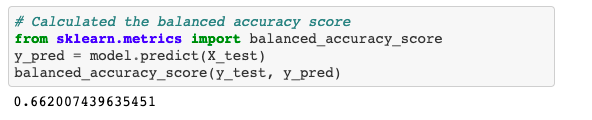

2. Confusion matrix:

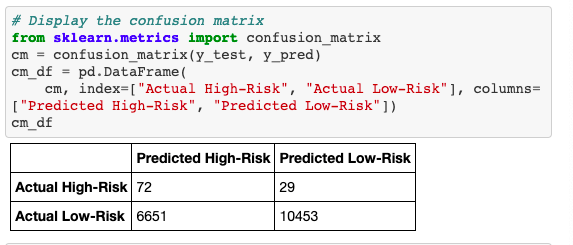

3.  Imbalanced classification report

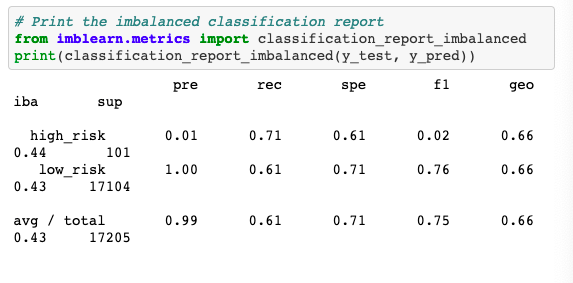

## SMOTE Oversampling
1. Smote Accuracy Score

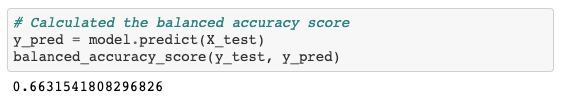

2. Confusion matrix

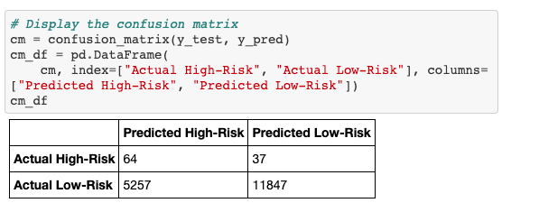

3. Imbalanced Classification Report

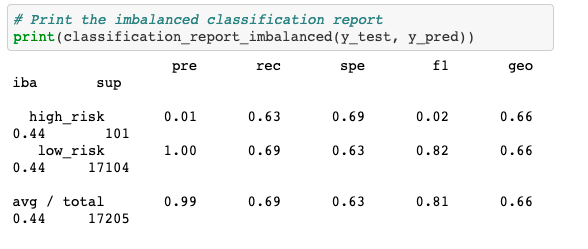

## Undersampling
1. Undersampling Accuracy Score

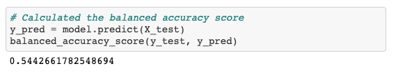

2. Undersampling Confusion matrix

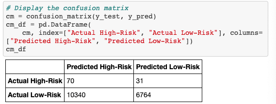

3. Undersampling Imbalanced Classification Report

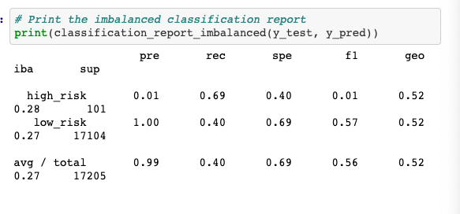

## Combination Sampling 

1. Combination Sampling Accuracy Score

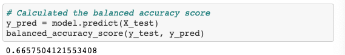

2. Combination Sampling Confusion matrix

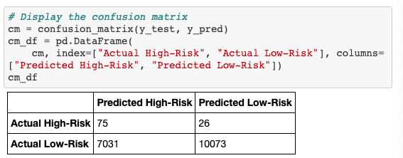

3. Combination Imbalanced Classification Report

