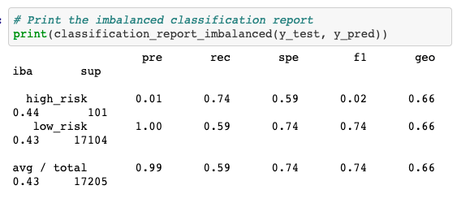
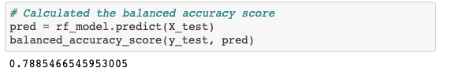
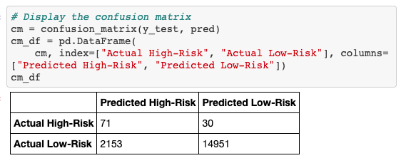
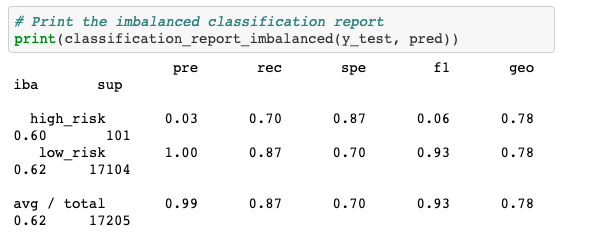
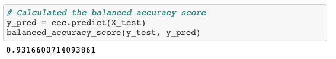
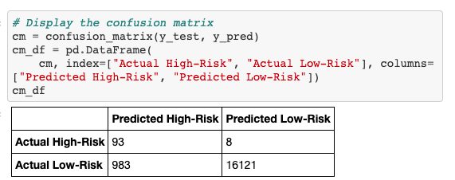
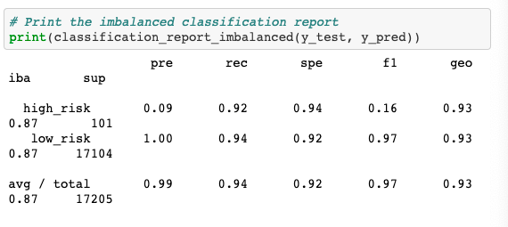

# Credit_Risk_Analysis

# The purpose: 
As a lead data scientist build and evaluate machine learning model or algorithms to predict credit risk. Technique need to be used in this challenge is sampling and boosting to make model and data.

# Results:

# Deliverable 1+2

## Naive Random Oversampling

1. Accuracy score for the mode:

2. Confusion matrix:

3.  Imbalanced classification report

## SMOTE Oversampling
1. Smote Accuracy Score

2. Confusion matrix

3. Imbalanced Classification Report

## Undersampling
1. Undersampling Accuracy Score

2. Undersampling Confusion matrix

3. Undersampling Imbalanced Classification Report

## Combination Sampling 

1. Combination Sampling Accuracy Score

2. Combination Sampling Confusion matrix

3. Combination Imbalanced Classification Report

# Deliverable 3

## Balanced Random Forest Classifier

1. Balanced Random Forest Classifier Accuracy Score

2. Balanced Random Forest Classifier Confusion matrix

3. Balanced Random Forest Classifier Imbalanced Classification Report

## Easy Ensemble AdaBoost Classifier

1. Easy Ensemble AdaBoost Classifier Accuracy Score

2. Easy Ensemble AdaBoost Classifier Confusion matrix

3. Easy Ensemble AdaBoost Classifier Imbalanced Classification Report

# Summary:
Oversampling models has accuracy scores of 66%. Undersampling model has accuracy scores of 54%. Based on the accuracy score the combination of 2 models mentioned above did not make much difference
The random forest has accuracy scores of 78%. Ensemble boost models has accuracy scores of 93%. The ensemble model had the best precision and sensitivity for high-risk loans.
We will lose the revenue if we overmark the riskes even the high riskes or low riskes in wrong ways. 

